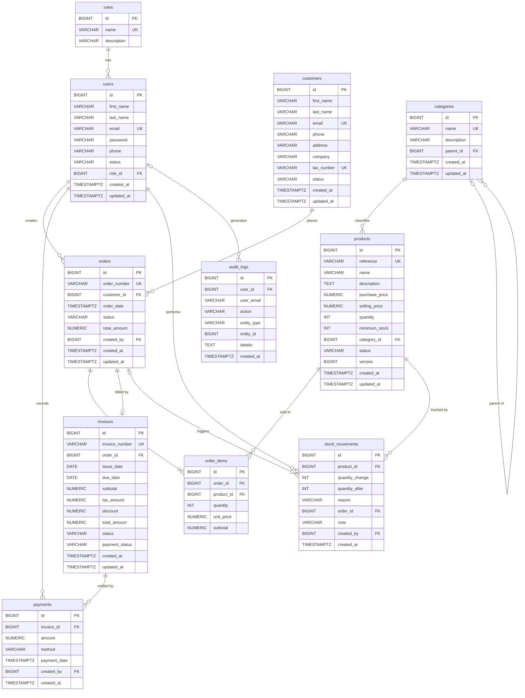

# Conception de la base de données

**Projet :** Business Management Platform (Enterprise Management Platform)
**SGBD :** PostgreSQL 17
**Version du document :** 1.0 (proposition à valider)
**Source :** cahier des charges v1.0, sections 23 à 36 (modèle de données et contraintes)

Ce document est la référence du schéma relationnel. Les entités JPA et les
migrations Flyway seront écrites **à partir de ce document**, jamais l'inverse.

---

## 1. Conventions

| Sujet | Convention |
|---|---|
| Tables | `snake_case`, pluriel (`order_items`) |
| Colonnes | `snake_case` (`created_at`) |
| Clé primaire | `id BIGINT GENERATED BY DEFAULT AS IDENTITY` |
| Clé étrangère | `<entité>_id` (`customer_id`) |
| Montants | `NUMERIC(14,3)` (le dinar tunisien a 3 décimales), `BigDecimal` côté Java |
| Dates techniques | `TIMESTAMPTZ`, `Instant` côté Java |
| Dates métier | `DATE` pour `issue_date` et `due_date` d'une facture |
| Énumérations | stockées en `VARCHAR` (`@Enumerated(EnumType.STRING)`) avec contrainte `CHECK` |
| Nom des contraintes | `pk_`, `fk_<table>_<cible>`, `uq_`, `ck_`, `idx_` |

---

## 2. Diagramme entité-relation (ERD)

Le diagramme est au format Mermaid : GitHub l'affiche directement.
Une version DBML est disponible dans `docs/erd.dbml` (import dans dbdiagram.io
pour exporter une image PNG ou PDF).

---

## 3. Dictionnaire de données

Légende : **NN** = NOT NULL, **UQ** = UNIQUE.

### 3.1 `roles`

| Colonne | Type | Null | Contraintes / défaut | Remarque |
|---|---|---|---|---|
| id | BIGINT | NN | PK | |
| name | VARCHAR(30) | NN | UQ, CHECK dans (ADMIN, MANAGER, EMPLOYEE) | `RoleType` |
| description | VARCHAR(255) | | | |

Données initiales (seed) : ADMIN, MANAGER, EMPLOYEE.
Table déjà créée par Hibernate (`ddl-auto=update`), à reprendre dans Flyway.

### 3.2 `users`

| Colonne | Type | Null | Contraintes / défaut | Remarque |
|---|---|---|---|---|
| id | BIGINT | NN | PK | |
| first_name | VARCHAR(100) | NN | | |
| last_name | VARCHAR(100) | NN | | |
| email | VARCHAR(255) | NN | UQ | identifiant de connexion (RG-03) |
| password | VARCHAR(255) | NN | | hash BCrypt, jamais en clair |
| phone | VARCHAR(20) | | | |
| status | VARCHAR(20) | NN | défaut `ACTIVE`, CHECK (ACTIVE, INACTIVE) | un compte inactif ne se connecte pas (RG-13) |
| role_id | BIGINT | NN | FK → roles.id | |
| created_at | TIMESTAMPTZ | NN | défaut `now()` | |
| updated_at | TIMESTAMPTZ | NN | défaut `now()` | |

### 3.3 `customers`

| Colonne | Type | Null | Contraintes / défaut | Remarque |
|---|---|---|---|---|
| id | BIGINT | NN | PK | |
| first_name | VARCHAR(100) | NN | | |
| last_name | VARCHAR(100) | NN | | |
| email | VARCHAR(255) | NN | UQ | à valider (D11) |
| phone | VARCHAR(20) | | | |
| address | VARCHAR(255) | | | |
| company | VARCHAR(150) | | | clients professionnels |
| tax_number | VARCHAR(50) | | UQ si renseigné (index unique partiel) | clients particuliers sans numéro |
| status | VARCHAR(20) | NN | défaut `ACTIVE`, CHECK (ACTIVE, INACTIVE) | suppression logique (D3) |
| created_at | TIMESTAMPTZ | NN | défaut `now()` | |
| updated_at | TIMESTAMPTZ | NN | défaut `now()` | |

### 3.4 `categories`

| Colonne | Type | Null | Contraintes / défaut | Remarque |
|---|---|---|---|---|
| id | BIGINT | NN | PK | |
| name | VARCHAR(100) | NN | UQ | |
| description | VARCHAR(255) | | | |
| parent_id | BIGINT | | FK → categories.id | hiérarchie (Informatique > Écrans), D15 |
| created_at | TIMESTAMPTZ | NN | défaut `now()` | |
| updated_at | TIMESTAMPTZ | NN | défaut `now()` | |

Contrainte : `CHECK (parent_id <> id)`.

### 3.5 `products`

| Colonne | Type | Null | Contraintes / défaut | Remarque |
|---|---|---|---|---|
| id | BIGINT | NN | PK | |
| reference | VARCHAR(50) | NN | UQ | ex. PC001 (RG-04) |
| name | VARCHAR(200) | NN | | |
| description | TEXT | | | |
| purchase_price | NUMERIC(14,3) | NN | CHECK > 0 | |
| selling_price | NUMERIC(14,3) | NN | CHECK > 0 | RG-05 |
| quantity | INTEGER | NN | défaut 0, CHECK >= 0 | stock courant |
| minimum_stock | INTEGER | NN | défaut 0, CHECK >= 0 | seuil de stock faible |
| category_id | BIGINT | NN | FK → categories.id | |
| status | VARCHAR(20) | NN | défaut `ACTIVE`, CHECK (ACTIVE, INACTIVE) | suppression logique (D3) |
| version | BIGINT | NN | défaut 0 | verrou optimiste (D6) |
| created_at | TIMESTAMPTZ | NN | défaut `now()` | |
| updated_at | TIMESTAMPTZ | NN | défaut `now()` | |

Stock faible : `quantity <= minimum_stock`. Rupture : `quantity = 0`.

### 3.6 `stock_movements` (ajout proposé, D10)

Historique de chaque entrée ou sortie de stock. `products.quantity` reste la
valeur courante, cette table explique **pourquoi** elle a changé.

| Colonne | Type | Null | Contraintes / défaut | Remarque |
|---|---|---|---|---|
| id | BIGINT | NN | PK | |
| product_id | BIGINT | NN | FK → products.id | |
| quantity_change | INTEGER | NN | CHECK <> 0 | négatif pour une sortie |
| quantity_after | INTEGER | NN | CHECK >= 0 | stock après mouvement |
| reason | VARCHAR(30) | NN | CHECK (voir 4) | |
| order_id | BIGINT | | FK → orders.id | renseigné pour les mouvements liés à une commande |
| note | VARCHAR(255) | | | |
| created_by | BIGINT | NN | FK → users.id | |
| created_at | TIMESTAMPTZ | NN | défaut `now()` | table en ajout seul |

### 3.7 `orders`

| Colonne | Type | Null | Contraintes / défaut | Remarque |
|---|---|---|---|---|
| id | BIGINT | NN | PK | |
| order_number | VARCHAR(30) | NN | UQ | ex. `ORD-2026-000001` |
| customer_id | BIGINT | NN | FK → customers.id | RG-01 |
| order_date | TIMESTAMPTZ | NN | défaut `now()` | |
| status | VARCHAR(20) | NN | défaut `PENDING`, CHECK (voir 4) | |
| total_amount | NUMERIC(14,3) | NN | défaut 0, CHECK >= 0 | somme des sous-totaux (RG-06) |
| created_by | BIGINT | NN | FK → users.id | |
| created_at | TIMESTAMPTZ | NN | défaut `now()` | |
| updated_at | TIMESTAMPTZ | NN | défaut `now()` | |

### 3.8 `order_items`

| Colonne | Type | Null | Contraintes / défaut | Remarque |
|---|---|---|---|---|
| id | BIGINT | NN | PK | |
| order_id | BIGINT | NN | FK → orders.id, `ON DELETE CASCADE` | |
| product_id | BIGINT | NN | FK → products.id | |
| quantity | INTEGER | NN | CHECK > 0 | RG-03 |
| unit_price | NUMERIC(14,3) | NN | CHECK > 0 | prix figé à la création (D8) |
| subtotal | NUMERIC(14,3) | NN | CHECK = quantity × unit_price | RG-05 |

Contrainte unique `(order_id, product_id)` : une seule ligne par produit dans une commande (D12).

### 3.9 `invoices`

| Colonne | Type | Null | Contraintes / défaut | Remarque |
|---|---|---|---|---|
| id | BIGINT | NN | PK | |
| invoice_number | VARCHAR(30) | NN | UQ | ex. `INV-2026-000001` (RG-12) |
| order_id | BIGINT | NN | UQ, FK → orders.id | une facture par commande (RG-11) |
| issue_date | DATE | NN | | |
| due_date | DATE | NN | CHECK >= issue_date | |
| subtotal | NUMERIC(14,3) | NN | CHECK >= 0 | |
| tax_amount | NUMERIC(14,3) | NN | défaut 0, CHECK >= 0 | taux de TVA à définir (point ouvert) |
| discount | NUMERIC(14,3) | NN | défaut 0, CHECK >= 0 | |
| total_amount | NUMERIC(14,3) | NN | CHECK = subtotal − discount + tax_amount | |
| status | VARCHAR(20) | NN | défaut `DRAFT`, CHECK (voir 4) | |
| payment_status | VARCHAR(20) | NN | défaut `UNPAID`, CHECK (voir 4) | |
| created_at | TIMESTAMPTZ | NN | défaut `now()` | |
| updated_at | TIMESTAMPTZ | NN | défaut `now()` | |

### 3.10 `payments`

| Colonne | Type | Null | Contraintes / défaut | Remarque |
|---|---|---|---|---|
| id | BIGINT | NN | PK | |
| invoice_id | BIGINT | NN | FK → invoices.id | |
| amount | NUMERIC(14,3) | NN | CHECK > 0 | |
| method | VARCHAR(20) | NN | CHECK (voir 4) | |
| payment_date | TIMESTAMPTZ | NN | défaut `now()` | |
| created_by | BIGINT | NN | FK → users.id | qui a enregistré le paiement |
| created_at | TIMESTAMPTZ | NN | défaut `now()` | |

Paiement simulé pour le MVP (cahier des charges, section 31).

### 3.11 `audit_logs`

| Colonne | Type | Null | Contraintes / défaut | Remarque |
|---|---|---|---|---|
| id | BIGINT | NN | PK | |
| user_id | BIGINT | | FK → users.id, `ON DELETE SET NULL` | |
| user_email | VARCHAR(255) | NN | | copie de l'e-mail, lisible même si l'utilisateur disparaît (D19) |
| action | VARCHAR(30) | NN | CHECK (voir 4) | |
| entity_type | VARCHAR(50) | | | ex. `PRODUCT`, `ORDER` |
| entity_id | BIGINT | | | |
| details | TEXT | | | description libre de la modification |
| created_at | TIMESTAMPTZ | NN | défaut `now()` | table en ajout seul (RG-14) |

---

## 4. Énumérations

| Enum Java | Valeurs | Source |
|---|---|---|
| `RoleType` | ADMIN, MANAGER, EMPLOYEE | cahier des charges, section 16 |
| `UserStatus` | ACTIVE, INACTIVE | à valider |
| `CustomerStatus` | ACTIVE, INACTIVE | **enum à créer** (absent aujourd'hui) |
| `ProductStatus` | ACTIVE, INACTIVE | à valider |
| `OrderStatus` | PENDING, CONFIRMED, SHIPPED, DELIVERED, CANCELLED | section 28 |
| `InvoiceStatus` | DRAFT, ISSUED, PAID, OVERDUE, CANCELLED | section 30 |
| `PaymentStatus` | UNPAID, PARTIALLY_PAID, PAID | section 31 |
| `PaymentMethod` | CASH, BANK_TRANSFER, CARD, CHECK | section 31 |
| `AuditAction` | LOGIN, CREATE, UPDATE, DELETE, CREATE_ORDER, UPDATE_ORDER, CREATE_INVOICE, UPDATE_INVOICE | section 34 |
| `StockMovementReason` | INITIAL_STOCK, ORDER_CONFIRMED, ORDER_CANCELLED, MANUAL_ADJUSTMENT | **enum à créer** si D10 est validé |

---

## 5. Comportement des clés étrangères

| Relation | Suppression du parent |
|---|---|
| users → roles | RESTRICT |
| products → categories | RESTRICT |
| categories → categories (parent) | RESTRICT |
| orders → customers | RESTRICT |
| orders → users (created_by) | RESTRICT |
| order_items → orders | **CASCADE** |
| order_items → products | RESTRICT |
| invoices → orders | RESTRICT |
| payments → invoices | RESTRICT |
| payments → users (created_by) | RESTRICT |
| stock_movements → products | RESTRICT |
| stock_movements → orders | RESTRICT |
| stock_movements → users | RESTRICT |
| audit_logs → users | **SET NULL** |

Conséquence : un client, un produit ou un utilisateur déjà utilisé ne peut pas être
supprimé physiquement. L'API le désactive (`status = INACTIVE`) ou renvoie
`409 Conflict`.

---

## 6. Index

Les contraintes `UNIQUE` créent déjà un index. Index supplémentaires :

| Index | Usage |
|---|---|
| `idx_users_role_id` | jointure utilisateur / rôle |
| `idx_categories_parent_id` | arbre des catégories |
| `idx_products_category_id` | filtre par catégorie |
| `idx_products_status` | liste des produits actifs |
| `idx_orders_customer_id` | historique d'un client |
| `idx_orders_status` | commandes en attente, dashboard |
| `idx_orders_order_date` | rapports par jour et par mois |
| `idx_orders_created_by` | « mes commandes » de l'employé |
| `idx_order_items_order_id` | lignes d'une commande |
| `idx_order_items_product_id` | produits les plus vendus |
| `idx_invoices_status` | factures par statut |
| `idx_invoices_payment_status` | factures impayées |
| `idx_invoices_due_date` | détection des retards |
| `idx_payments_invoice_id` | paiements d'une facture |
| `idx_stock_movements_product_created` | historique de stock `(product_id, created_at)` |
| `idx_audit_logs_created_at` | consultation chronologique |
| `idx_audit_logs_user_id` | actions d'un utilisateur |
| `idx_audit_logs_entity` | historique d'une entité `(entity_type, entity_id)` |
| `uq_customers_tax_number` | unicité partielle `WHERE tax_number IS NOT NULL` |

---

## 7. Où sont appliquées les règles

| Règle | Base de données | Couche service |
|---|---|---|
| Unicité (e-mail, référence, numéros) | UNIQUE | contrôle préalable pour un message clair |
| Prix > 0, quantité >= 0 | CHECK | validation Bean Validation sur les DTO |
| Stock suffisant (RG-08) | CHECK quantity >= 0 (filet de sécurité) | vérification métier avant confirmation |
| Total = somme des sous-totaux (RG-06) | CHECK sur chaque ligne | calcul dans `OrderService` |
| Transitions de statut d'une commande | CHECK sur les valeurs | machine à états dans `OrderService` |
| Commande livrée non modifiable (RG-08) | | `OrderService` |
| Facture seulement pour une commande confirmée | | `InvoiceService` |
| Somme des paiements <= total facture | | `PaymentService` |
| Mise à jour du stock à la confirmation | | transaction unique dans `OrderService` |
| Traçabilité (RG-14) | table `audit_logs` | service d'audit |

---

## 8. Écarts avec le cahier des charges et décisions à valider

Les décisions D1 à D8 sont dans `docs/architecture.md`.

| # | Décision | Écart ? | Recommandation |
|---|---|---|---|
| D9 | `createdAt` / `updatedAt` sur les tables principales. `created_by` seulement sur `orders`, `payments`, `stock_movements`. Pas de `updated_by`. | Léger : le cahier ne prévoit `createdBy` que sur `Order` | Valider. L'audit log couvre le reste. |
| D10 | Ajouter la table `stock_movements` | **Ajout** : l'entité `Inventory` du cahier n'a pas de structure définie | Valider. Elle donne la traçabilité du stock. |
| D11 | `customers.email` obligatoire et unique, `tax_number` unique si renseigné | Précision : le cahier ne liste pas ces unicités pour les clients | Valider. Évite les doublons clients (problème n°1 du cahier). |
| D12 | Une seule ligne par produit dans une commande | Précision | Valider. |
| D13 | `TIMESTAMPTZ` côté base, `Instant` côté Java | Technique | Valider. |
| D14 | Créer l'enum `CustomerStatus` | Le champ `status` existe sur `Customer` mais pas l'enum | Valider. |
| D15 | Catégories hiérarchiques via `parent_id` | Le cahier montre un arbre mais ne définit pas la colonne | Valider. |
| D16 | Cohérence entre `invoices.status` et `payment_status` définie à l'étape Factures. `OVERDUE` calculé plus tard (tâche planifiée, version 2). | Précision | Reporter. |
| D17 | Pas de suppression physique d'un utilisateur déjà référencé | Précision de `DELETE /api/users/{id}` | Valider. |
| D18 | `payments.created_by` obligatoire | Ajout minime | Valider. |
| D19 | `audit_logs.user_email` conservé en copie | Précision | Valider. |

### Points encore ouverts

- Taux de TVA : paramètre configurable, 19 % par défaut proposé.
- Restauration du stock lors de l'annulation d'une commande confirmée : proposée, à confirmer à l'étape Commandes.
- Format exact des numéros de commande et de facture : proposé `ORD-AAAA-NNNNNN` et `INV-AAAA-NNNNNN`.

---

## 9. Étapes suivantes

1. Valider ce document (réponses aux décisions D9 à D19).
2. Ajouter Flyway et écrire `V1__init_schema.sql` à partir de ce document.
3. Passer `ddl-auto` à `validate`.
4. Créer les entités JPA une par une, en vérifiant que `validate` passe à chaque ajout.
